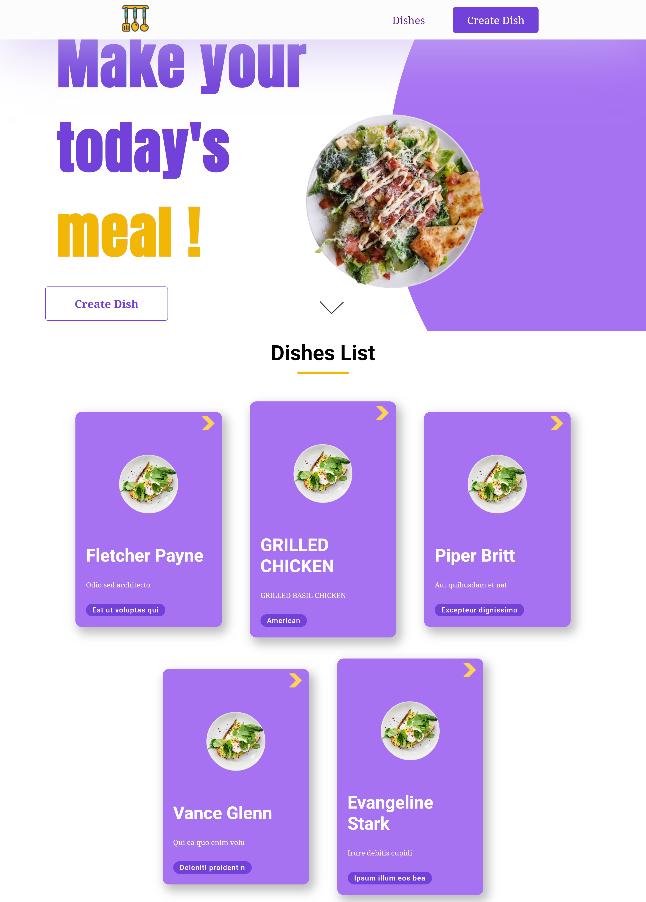
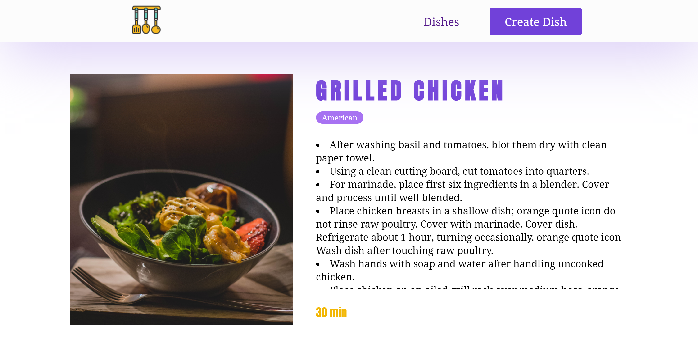
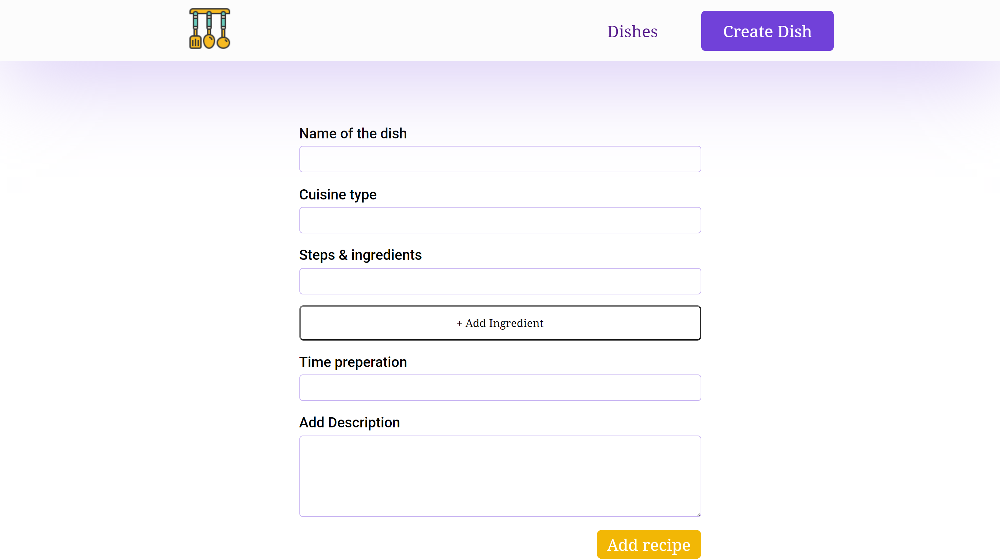

# Recipe App

This is a Recipe app with vue.js with firebase.

The app have a validation form before storing in firebase.

## Start Project

To start this project run

```bash
  npm run serve
```

## Project overview




